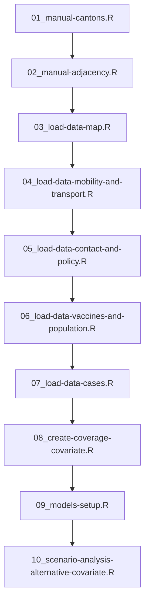
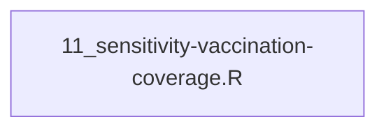

# ee-vax

The preprocessing scripts stored in the `munge` directory are executed sequentially when `load.project()` is called. The numbered prefixes indicate the ordering of execution.

After this scripts for sensitivity analyses are run

